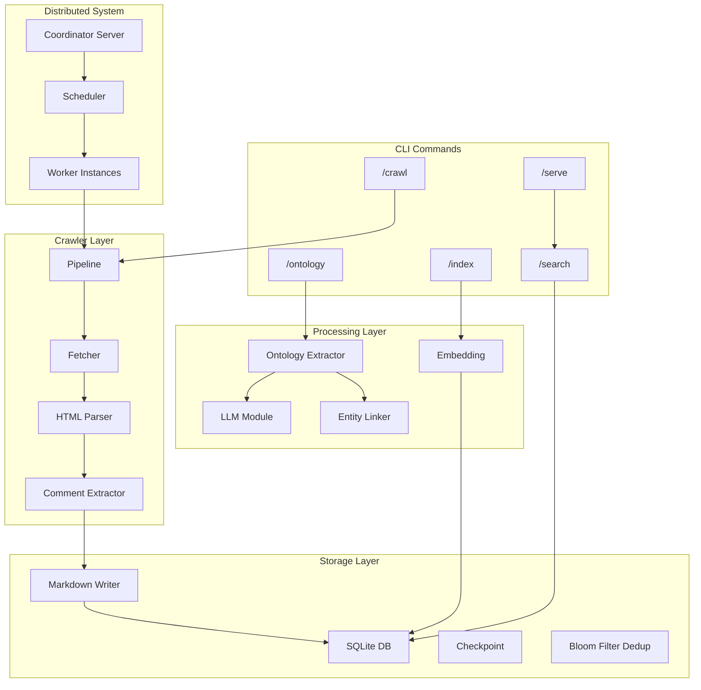
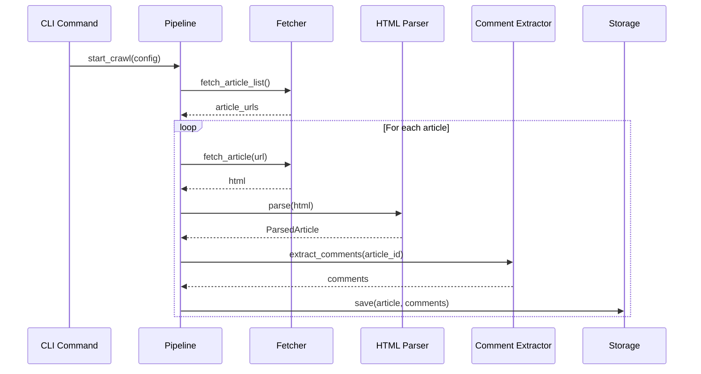
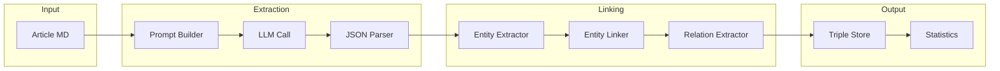
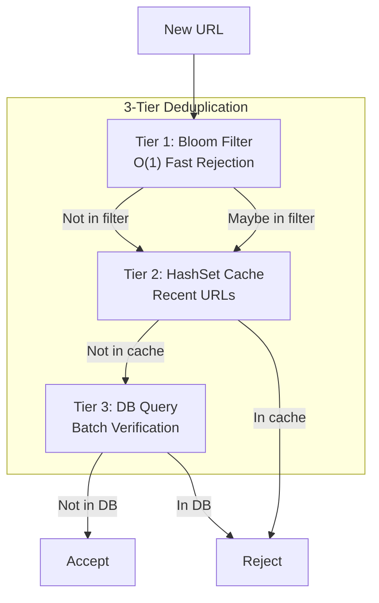
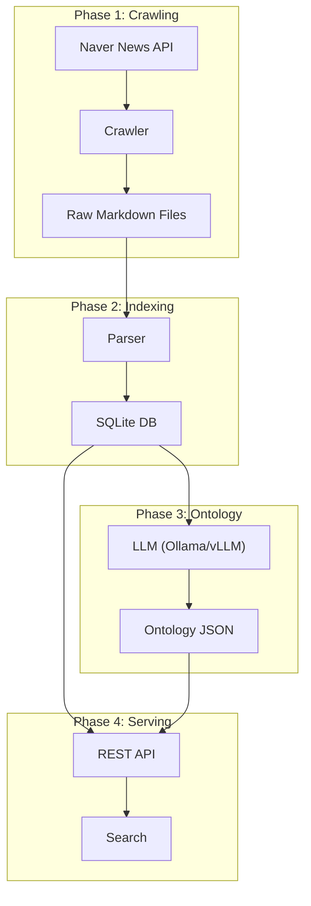

# Baram Architecture

> Baram은 네이버 뉴스 크롤링, 온톨로지 추출, 벡터 검색을 지원하는 Rust 기반 시스템입니다.

## 시스템 개요



## 디렉토리 구조

```
src/
├── commands/           # CLI 명령어 핸들러
│   ├── mod.rs         # 모듈 익스포트
│   ├── crawl.rs       # 크롤링 명령어 (296 lines)
│   ├── index.rs       # 인덱싱 명령어 (321 lines)
│   ├── ontology.rs    # 온톨로지 추출 명령어 (319 lines)
│   ├── search.rs      # 검색 명령어 (83 lines)
│   └── serve.rs       # 웹 서버 명령어 (515 lines)
│
├── config/            # 설정 관리
│   └── mod.rs         # AppConfig, CrawlerConfig 등
│
├── coordinator/       # 분산 크롤링 코디네이터
│   ├── mod.rs
│   ├── api.rs         # REST API 엔드포인트
│   ├── client.rs      # 워커 클라이언트
│   ├── config.rs      # 코디네이터 설정
│   ├── registry.rs    # 워커 레지스트리
│   └── server.rs      # 코디네이터 서버
│
├── crawler/           # 크롤링 핵심 로직
│   ├── mod.rs
│   ├── comment.rs     # 댓글 수집 (1,774 lines)
│   ├── distributed.rs # 분산 크롤링 (1,109 lines)
│   ├── fetcher.rs     # HTTP 요청
│   ├── headers.rs     # HTTP 헤더 관리
│   ├── instance.rs    # 크롤러 인스턴스
│   ├── list.rs        # 기사 목록 크롤링
│   ├── pipeline.rs    # 크롤링 파이프라인 (904 lines)
│   ├── status.rs      # 상태 관리 (907 lines)
│   ├── trigger.rs     # 트리거 메커니즘 (753 lines)
│   └── url.rs         # URL 처리
│
├── embedding/         # 벡터 임베딩
│   ├── mod.rs         # 임베딩 메인 로직 (875 lines)
│   ├── tokenizer.rs   # 토크나이저
│   └── vectorize.rs   # 벡터화
│
├── llm/               # LLM 연동
│   └── mod.rs         # Ollama/vLLM 클라이언트 (775 lines)
│
├── metrics/           # 메트릭스 수집
│   └── mod.rs
│
├── ontology/          # 온톨로지 추출
│   ├── mod.rs
│   ├── error.rs       # 온톨로지 에러 타입
│   ├── extractor.rs   # Triple 추출기 (2,702 lines)
│   ├── linker.rs      # 엔티티 링커 (1,728 lines)
│   ├── stats.rs       # 통계 (818 lines)
│   └── storage.rs     # 온톨로지 저장 (910 lines)
│
├── parser/            # HTML 파싱
│   ├── mod.rs
│   ├── html.rs        # HTML 파서 (727 lines)
│   ├── sanitize.rs    # 콘텐츠 정제
│   └── selectors.rs   # CSS 셀렉터 (lazy_static)
│
├── scheduler/         # 분산 스케줄러
│   ├── mod.rs
│   ├── assignment.rs  # 작업 할당 (728 lines)
│   ├── distribution.rs # 부하 분산 (734 lines)
│   ├── error.rs       # 스케줄러 에러
│   ├── failover.rs    # 장애 복구 (959 lines)
│   ├── rotation.rs    # 로테이션
│   ├── schedule.rs    # 스케줄 관리
│   └── trigger.rs     # 스케줄 트리거
│
├── storage/           # 저장소
│   ├── mod.rs         # SQLite 연동 (731 lines)
│   ├── checkpoint.rs  # 체크포인트 (783 lines)
│   ├── dedup.rs       # Bloom Filter 중복제거 (1,108 lines)
│   └── markdown.rs    # 마크다운 저장 (1,261 lines)
│
├── utils/             # 유틸리티
│   ├── mod.rs
│   ├── error.rs       # 에러 타입 정의
│   └── retry.rs       # 재시도 로직 (지수 백오프)
│
├── lib.rs             # 라이브러리 엔트리
├── main.rs            # CLI 엔트리포인트
└── models.rs          # 공통 데이터 모델
```

## 핵심 모듈 상세

### 1. Commands 모듈 (`src/commands/`)

CLI 명령어를 처리하는 모듈로, main.rs에서 분리되어 독립적으로 관리됩니다.

| 명령어 | 파일 | 설명 |
|--------|------|------|
| `crawl` | crawl.rs | 네이버 뉴스 크롤링 실행 |
| `index` | index.rs | 크롤링된 기사 인덱싱 (체크포인트 지원) |
| `ontology` | ontology.rs | LLM 기반 온톨로지 추출 (부분 실패 처리) |
| `search` | search.rs | 저장된 기사 검색 |
| `serve` | serve.rs | REST API 서버 실행 |

### 2. Crawler 모듈 (`src/crawler/`)



**주요 컴포넌트:**

- **Fetcher**: HTTP 요청 처리, Rate Limiting, 재시도 로직
- **Pipeline**: 크롤링 파이프라인 오케스트레이션
- **Comment**: 댓글 API 호출 및 파싱
- **Distributed**: 다중 워커 분산 크롤링

### 3. Ontology 모듈 (`src/ontology/`)



**Triple 구조:**
```rust
pub struct Triple {
    pub subject: String,      // 주어 (예: "김수종")
    pub subject_type: String, // 타입 (예: "Person")
    pub predicate: String,    // 관계 (예: "schema:author")
    pub object: String,       // 목적어 (예: "발언 내용")
    pub object_type: String,  // 타입 (예: "Statement")
    pub confidence: f32,      // 신뢰도
    pub evidence: String,     // 근거 텍스트
    pub verified: bool,       // 검증 여부
}
```

### 4. Storage 모듈 (`src/storage/`)



**저장소 구성:**

- **SQLite**: 기사 메타데이터, 크롤 상태
- **Markdown**: 기사 본문 (파일 시스템)
- **Checkpoint**: 장기 작업 체크포인트
- **Bloom Filter**: URL 중복 검사 (~90% DB 쿼리 감소)

### 5. Scheduler 모듈 (`src/scheduler/`)

분산 크롤링을 위한 작업 스케줄링:

- **Assignment**: 워커별 작업 할당
- **Distribution**: 부하 분산 알고리즘
- **Failover**: 장애 복구 및 작업 재할당
- **Rotation**: User-Agent 및 프록시 로테이션

## 데이터 흐름



## 설정 구조

```toml
[app]
name = "baram"
version = "0.1.0"
environment = "production"

[crawler]
base_url = "https://news.naver.com"
requests_per_second = 5
max_retries = 3
timeout_secs = 30
max_concurrent_workers = 10
channel_buffer_size = 1000

[crawler.comments]
enabled = true
max_pages = 100

[storage]
output_dir = "./output/raw"
checkpoint_dir = "./output/checkpoints"
sqlite_path = "./output/crawl.db"

[llm]
provider = "vllm"  # or "ollama"
base_url = "http://localhost:8000"
model = "Qwen/Qwen3-8B"

[ontology]
enabled = true
batch_size = 2
max_concurrent = 4
```

## 에러 처리

모든 모듈은 `thiserror` 기반 에러 타입을 사용합니다:

```rust
// 주요 에러 타입
pub enum CrawlerError { HttpError, RateLimitError, ParseError, ... }
pub enum StorageError { SqliteError, FileError, ... }
pub enum OntologyError { ExtractionError, ValidationError, ... }

// Result 타입 별칭
pub type CrawlerResult<T> = Result<T, CrawlerError>;
pub type AppResult<T> = Result<T, AppError>;
```

**재시도 로직** (`src/utils/retry.rs`):
- 지수 백오프 (Exponential Backoff)
- 조건부 재시도 (Conditional Retry)
- 최대 재시도 횟수 설정

## 테스트

```bash
# 단위 테스트
cargo test

# 통합 테스트
cargo test --test integration

# 특정 모듈 테스트
cargo test ontology::
cargo test crawler::
```

**통합 테스트 구조** (`tests/integration_tests/`):
- `pipeline_test.rs`: 크롤링 파이프라인 테스트
- `distributed_test.rs`: 분산 크롤링 테스트
- `error_scenarios.rs`: 에러 시나리오 테스트

## 의존성

| 크레이트 | 용도 |
|----------|------|
| `tokio` | 비동기 런타임 |
| `reqwest` | HTTP 클라이언트 |
| `scraper` | HTML 파싱 |
| `rusqlite` | SQLite |
| `serde` | 직렬화 |
| `thiserror` | 에러 처리 |
| `lazy_static` | 정적 초기화 |
| `bloomfilter` | Bloom Filter |
| `clap` | CLI 파싱 |

## 라이선스

GPL v3 - Copyright (c) 2024 hephaex@gmail.com
