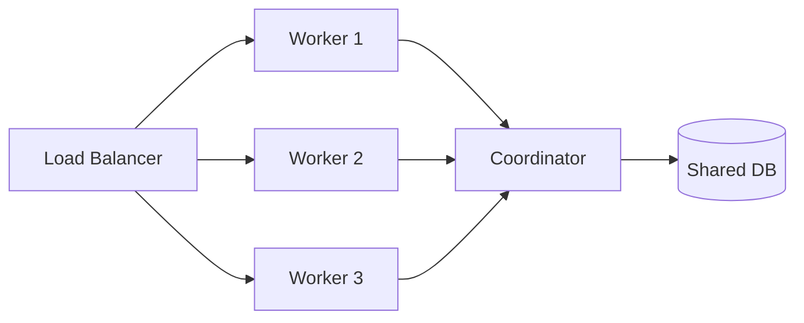

# Baram Operations Guide

이 문서는 Baram 시스템의 운영, 모니터링, 문제 해결에 대한 가이드입니다.

## 빠른 시작

### 설치

```bash
# 소스에서 빌드
git clone https://github.com/hephaex/Baram.git
cd Baram
cargo build --release

# 바이너리 위치
./target/release/baram
```

### 기본 실행

```bash
# 크롤링 실행
./baram crawl --category politics --max-articles 100

# 인덱싱
./baram index

# 온톨로지 추출
./baram ontology --llm-extract

# 검색
./baram search --query "AI 정책"

# 웹 서버
./baram serve --port 8080
```

## 성능 튜닝

### 크롤링 최적화

```toml
# config.toml
[crawler]
# 초당 요청 수 (네이버 정책 고려)
requests_per_second = 5

# 동시 워커 수 (CPU 코어 수 고려)
max_concurrent_workers = 10

# 채널 버퍼 크기
channel_buffer_size = 1000

# 타임아웃 (초)
timeout_secs = 30

# 재시도 설정
max_retries = 3
backoff_base_ms = 1000
backoff_max_ms = 30000
```

**권장 설정 (환경별):**

| 환경 | requests_per_second | workers | buffer |
|------|---------------------|---------|--------|
| 개발 | 2 | 4 | 100 |
| 스테이징 | 5 | 8 | 500 |
| 프로덕션 | 5 | 16 | 1000 |

### 온톨로지 추출 최적화

```toml
[ontology]
batch_size = 2        # 배치당 기사 수
max_concurrent = 4    # 동시 LLM 요청 수

[llm]
provider = "vllm"     # vllm이 ollama보다 빠름
timeout_secs = 120    # LLM 타임아웃
```

**GPU 메모리별 권장 설정:**

| GPU VRAM | batch_size | max_concurrent |
|----------|------------|----------------|
| 8GB | 1 | 2 |
| 16GB | 2 | 4 |
| 24GB+ | 4 | 8 |

### 메모리 최적화

```bash
# Bloom Filter 크기 조정 (storage/dedup.rs)
# 예상 URL 수에 따라 조정

# 1M URLs: ~1.2MB 메모리
# 10M URLs: ~12MB 메모리
# 100M URLs: ~120MB 메모리
```

## 모니터링

### 로그 설정

```bash
# 로그 레벨 설정
export RUST_LOG=info

# 상세 디버그
export RUST_LOG=debug

# 특정 모듈만
export RUST_LOG=baram::crawler=debug,baram::ontology=info
```

### 로그 파일

```
logs/
├── crawl-YYYYMMDD.log      # 크롤링 로그
├── ontology-YYYYMMDD.log   # 온톨로지 로그
└── cron.log                # 스케줄 작업 로그
```

### 주요 메트릭

```bash
# 크롤링 진행률
tail -f logs/crawl-$(date +%Y%m%d).log | grep "Progress"

# 온톨로지 추출률
tail -f logs/ontology-*.log | grep "Extracted"

# 에러 모니터링
grep -E "ERROR|WARN" logs/*.log
```

### 상태 확인 스크립트

```bash
#!/bin/bash
# check_status.sh

echo "=== Baram Status ==="
echo ""

# DB 상태
echo "Articles in DB:"
sqlite3 output/crawl.db "SELECT COUNT(*) FROM articles;"

echo ""
echo "Articles by category:"
sqlite3 output/crawl.db "SELECT category, COUNT(*) FROM articles GROUP BY category;"

echo ""
echo "Recent crawl (last 24h):"
sqlite3 output/crawl.db "SELECT COUNT(*) FROM articles WHERE crawled_at > datetime('now', '-1 day');"

echo ""
echo "Ontology files:"
ls -la output/ontology/*.json 2>/dev/null | tail -5
```

## 문제 해결 (Troubleshooting)

### 일반적인 문제

#### 1. 크롤링이 느림

**증상:** 기사 수집 속도가 예상보다 느림

**원인 및 해결:**
```bash
# 1. Rate Limiting 확인
grep "429" logs/crawl-*.log

# 해결: requests_per_second 낮추기
# config.toml
requests_per_second = 3

# 2. 네트워크 지연 확인
curl -w "@curl-format.txt" -o /dev/null -s "https://news.naver.com"

# 해결: timeout_secs 늘리기
timeout_secs = 60
```

#### 2. 온톨로지 추출 실패

**증상:** LLM 호출 에러 또는 빈 결과

**원인 및 해결:**
```bash
# 1. LLM 서버 상태 확인
curl http://localhost:8000/health  # vLLM
curl http://localhost:11434/api/tags  # Ollama

# 2. 메모리 확인
nvidia-smi  # GPU 메모리

# 해결: batch_size 줄이기
batch_size = 1
max_concurrent = 2

# 3. 프롬프트 문제 확인
export RUST_LOG=baram::ontology=debug
./baram ontology --llm-extract --limit 1
```

#### 3. SQLite 잠금 오류

**증상:** `database is locked` 에러

**원인 및 해결:**
```bash
# 1. 동시 프로세스 확인
ps aux | grep baram

# 2. 잠금 해제
# 실행 중인 프로세스 종료 후 재시도

# 3. WAL 모드 활성화 (config.toml)
[storage]
sqlite_wal_mode = true
```

#### 4. 메모리 부족

**증상:** OOM 에러 또는 시스템 느려짐

**원인 및 해결:**
```bash
# 1. 메모리 사용량 확인
htop

# 2. Bloom Filter 크기 조정
# src/storage/dedup.rs의 BLOOM_EXPECTED_ITEMS 조정

# 3. 배치 크기 줄이기
batch_size = 1
max_concurrent = 2
channel_buffer_size = 100
```

#### 5. 체크포인트 복구

**증상:** 작업이 중단되어 재시작 필요

**해결:**
```bash
# 체크포인트 확인
ls -la output/checkpoints/

# 체크포인트에서 재시작
./baram index --resume
./baram ontology --resume
```

### 에러 코드

| 코드 | 설명 | 해결 방법 |
|------|------|-----------|
| `E001` | HTTP 요청 실패 | 네트워크 확인, 재시도 |
| `E002` | 파싱 실패 | HTML 구조 변경 확인 |
| `E003` | DB 에러 | SQLite 잠금 확인 |
| `E004` | LLM 타임아웃 | timeout_secs 증가 |
| `E005` | 메모리 부족 | 배치 크기 감소 |

## 백업 및 복구

### 데이터 백업

```bash
#!/bin/bash
# backup.sh

BACKUP_DIR="/backup/baram/$(date +%Y%m%d)"
mkdir -p $BACKUP_DIR

# SQLite 백업
sqlite3 output/crawl.db ".backup '$BACKUP_DIR/crawl.db'"

# 마크다운 백업
tar -czf $BACKUP_DIR/raw.tar.gz output/raw/

# 온톨로지 백업
cp output/ontology/*.json $BACKUP_DIR/

echo "Backup completed: $BACKUP_DIR"
```

### 복구

```bash
#!/bin/bash
# restore.sh

BACKUP_DIR=$1
if [ -z "$BACKUP_DIR" ]; then
    echo "Usage: restore.sh /path/to/backup"
    exit 1
fi

# 기존 데이터 백업
mv output output.old

# 복구
mkdir -p output
cp $BACKUP_DIR/crawl.db output/
tar -xzf $BACKUP_DIR/raw.tar.gz -C output/
mkdir -p output/ontology
cp $BACKUP_DIR/*.json output/ontology/

echo "Restore completed from: $BACKUP_DIR"
```

## 스케줄링

### Cron 설정

```bash
# crontab -e

# 매시간 크롤링
0 * * * * /path/to/baram crawl --max-articles 300 >> /path/to/logs/cron.log 2>&1

# 매일 새벽 2시 인덱싱
0 2 * * * /path/to/baram index >> /path/to/logs/cron.log 2>&1

# 매일 새벽 3시 온톨로지 추출
0 3 * * * /path/to/baram ontology --llm-extract >> /path/to/logs/cron.log 2>&1
```

### Systemd 서비스

```ini
# /etc/systemd/system/baram-serve.service
[Unit]
Description=Baram News API Server
After=network.target

[Service]
Type=simple
User=baram
WorkingDirectory=/opt/baram
ExecStart=/opt/baram/target/release/baram serve --port 8080
Restart=always
RestartSec=5
Environment=RUST_LOG=info

[Install]
WantedBy=multi-user.target
```

```bash
# 서비스 활성화
sudo systemctl enable baram-serve
sudo systemctl start baram-serve
sudo systemctl status baram-serve
```

## 보안 고려사항

### API 보안

```toml
# config.toml
[server]
# API 키 활성화
require_api_key = true
api_keys = ["${API_KEY}"]

# CORS 설정
allowed_origins = ["https://example.com"]

# Rate Limiting
rate_limit_per_minute = 60
```

### 민감 정보 관리

```bash
# 환경 변수 사용
export DB_PASSWORD="..."
export LLM_API_KEY="..."

# config.toml에서 참조
password = "${DB_PASSWORD}"
api_key = "${LLM_API_KEY}"
```

## 확장성

### 수평 확장



**분산 크롤링 설정:**

```bash
# 코디네이터 시작
./baram serve --coordinator --port 9000

# 워커 시작 (여러 머신에서)
./baram crawl --worker --coordinator-url http://coordinator:9000
```

## 참고 자료

- [ARCHITECTURE.md](../ARCHITECTURE.md) - 시스템 아키텍처
- [DEVELOPER_GUIDE.md](./DEVELOPER_GUIDE.md) - 개발자 가이드
- [DEPLOYMENT_QUICK_START.md](../DEPLOYMENT_QUICK_START.md) - 배포 가이드
